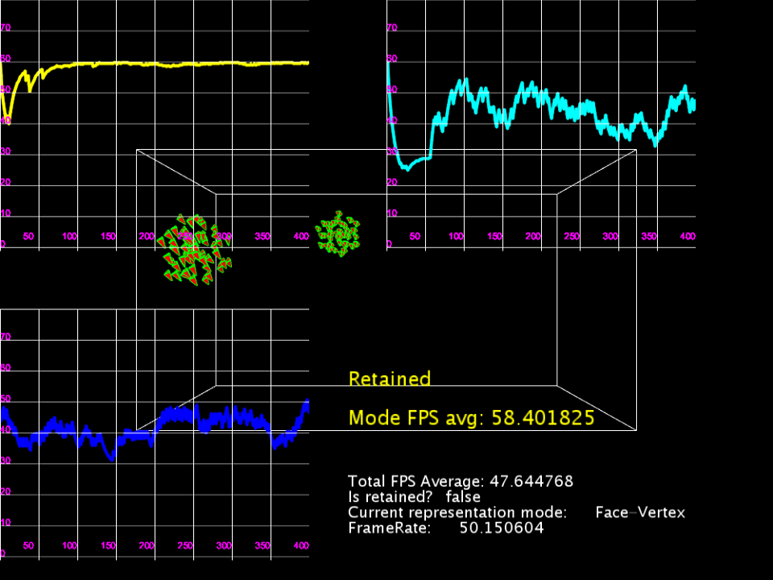
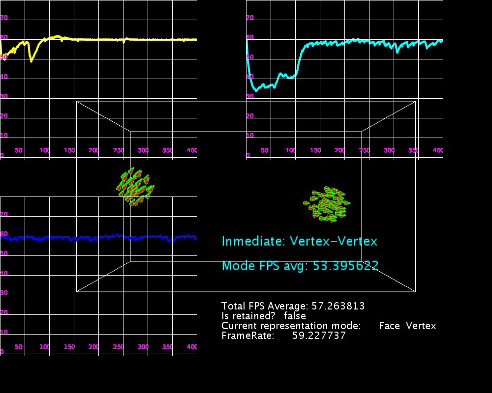
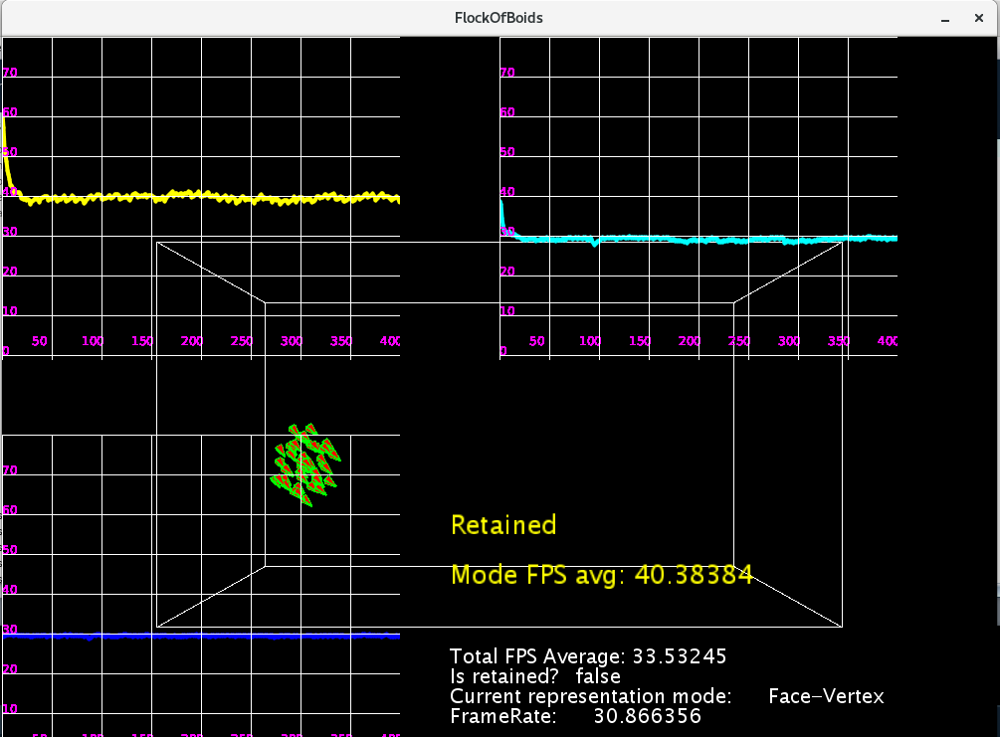
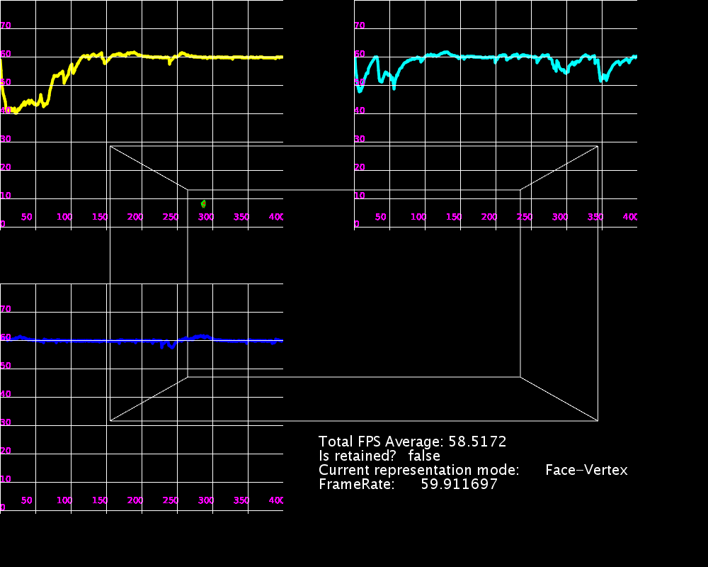

# Comparación de Hardware

## Propósito

Medir el rendimiento del programa en diferentes configuraciones de Hardware.

## Resultados

| Marca | CPU(s) | Bits| Vel Procesador|RAM|Sistema Operativo|
|-----|-----|-----|-----|-----|-----|
|Sony Vaio  | 2 cores   | 64 bits |2.5GHz|4.0 GB| Windows |

| Marca | CPU(s) | Bits| Vel Procesador|RAM|Sistema Operativo|
|-----|-----|-----|-----|-----|-----|
|Asus  | 2 cores | 64 bits |3.0GHz|8.0 GB| Linux |

| Marca | CPU(s) | Bits| Vel Procesador|RAM|Sistema Operativo|
|-----|-----|-----|-----|-----|-----|
|HP  | 2 cores | 32 bits |2.5GHz|2.0 GB| Linux |

| Marca | CPU(s) | Bits| Vel Procesador|RAM|Sistema Operativo|
|-----|-----|-----|-----|-----|-----|
|Janus  | 2 cores | 64 bits |2.7GHz|6.0 GB| Linux |

